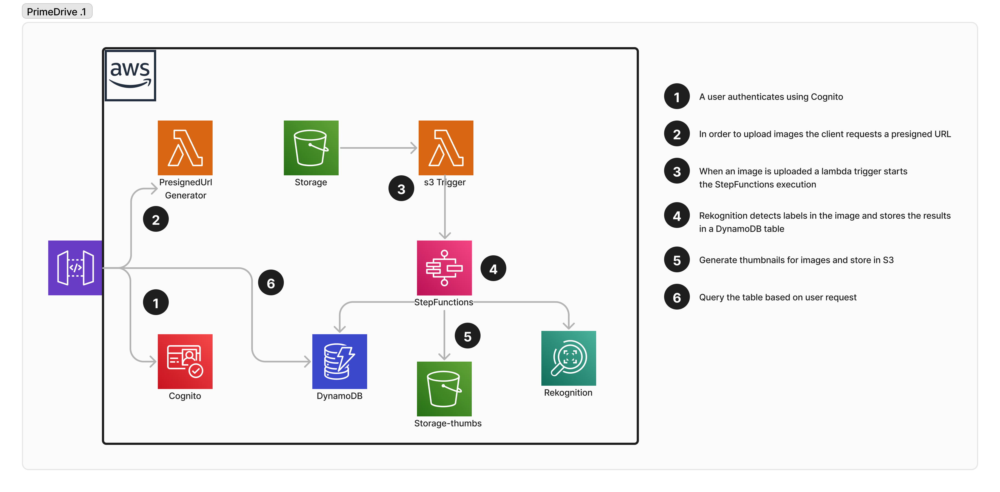

# PrimeDrive

### architecture

### demo video

## This is a CDK project covering the following AWS services:
- S3
- Lambda
- API Gateway
- DynamoDB
- Step Functions
- Rekognition
- Cognito

The project is a simple image recognition application. The user uploads an image to an S3 bucket, which triggers a Lambda function. The Lambda function then calls the Rekognition service to detect labels in the image. The labels are then stored in a DynamoDB table. The user can quickly and easily find images based on labels that are being stored as indices in DynamoDB.

Please note that I explicitly set my region to `eu-central-1` to make sure Rekognition is an available service. If you want to use another region, you need to check if Rekognition is available in that region.

**Functionalities**:
- Auth Flow 
- The user can upload an image to an S3 bucket.
- The image is processed by Rekognition to detect labels. These labels are stored in a DynamoDB table.
---

**Backend testing with Postman**:\
workspace url: https://www.postman.com/navigation-explorer-20792451/workspace/primedrive/collection/28154890-0163d560-b86c-442c-b12d-f2e5fa73d9fe?action=share&creator=28154890

**TODO**:
- ~~Add the query endpoint to the API Gateway, so the user can query the DynamoDB table for images based on labels.~~

**Optional**:
- ~~Add a thumbnail generation step to the Step Functions state machine.~~
- ~~Add a frontend to the application to make it more user-friendly.~~
- ~~Refacror the code so it's more organized and easier to read.~~
- Modify Policies to be more restrictive.